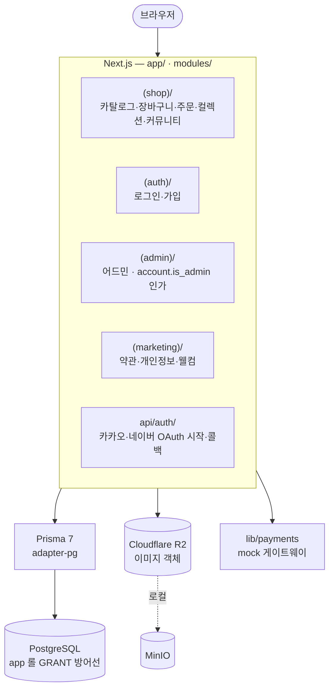

# iroiro

K-pop·J-pop 굿즈 커머스 — 카탈로그·주문·결제부터 구매한 굿즈의 컬렉션 전시와 팬 커뮤니티까지.

**Stack**: Next.js 16 (App Router) · React 19 · TypeScript · Tailwind v4 + shadcn/ui · PostgreSQL 17 (AWS RDS / 로컬 Docker) · Prisma 7 · Cloudflare R2 (로컬은 MinIO) · 카카오·네이버 자체 OAuth · Vitest



## 목차

- [사전 요구사항](#사전-요구사항)
- [빠른 시작](#빠른-시작)
- [일상 명령어](#일상-명령어)
- [프로젝트 구조](#프로젝트-구조)
- [개발 규칙](#개발-규칙)
- [문서](#문서)
- [문제 해결](#문제-해결)

## 사전 요구사항

| 도구 | 용도 | 설치 |
|---|---|---|
| **Node.js 20+** | Next.js 런타임·빌드 | [nodejs.org](https://nodejs.org) 또는 nvm |
| **Docker Desktop** | Postgres·MinIO 컨테이너 | [docker.com](https://www.docker.com/products/docker-desktop) |
| 카카오·네이버 개발자 앱 | 소셜 로그인 흐름을 실제로 검증할 때만 | [.env.local.example](./.env.local.example) 주석 참고 |

## 빠른 시작

```bash
git clone <repo-url>
cd iroiro

# postinstall이 .env.local.example → .env.local 을 자동 복사한다
npm install
```

`.env.local`에서 **다음 3개를 채웁니다.** 비어 있으면 부팅이 ZodError로 즉시 실패합니다 (휴면 배포를 막는 fail-fast 설계). 로그인 흐름을 검증하지 않을 거라면 임시 더미 문자열로도 부팅됩니다.

```
KAKAO_REST_API_KEY=
NAVER_CLIENT_ID=
NAVER_CLIENT_SECRET=
```

나머지 변수는 로컬 공개 디폴트로 동작합니다 → [환경변수 레퍼런스](./docs/environment-variables.md)

```bash
# 로컬 스택(Postgres + MinIO) 기동 후 Next.js 실행 — Docker 필요
npm run dev:all
# 첫 실행 1회: 스키마 적용 + app 롤 LOGIN 부여
npm run db:reset
```

첫 실행은 컨테이너 이미지를 받아오느라 1~2분 걸릴 수 있습니다. 다음 페이지가 뜨면 정상입니다.

- <http://localhost:3000> — 공개 카탈로그 (초기 DB는 비어 있음)
- <http://localhost:3000/login> — 소셜 로그인 진입 화면

### 어드민 열기

`/admin`은 로그인한 계정의 `is_admin`을 실검증합니다. 관리자 지정은 pre-launch 동안 수동 운영입니다.

1. `/login`에서 카카오 또는 네이버로 로그인하고 `/signup`에서 닉네임까지 입력해 계정을 만듭니다.
2. 본인 계정에 관리자를 지정합니다 (1회, `docker compose exec postgres psql -U postgres -d iroiro` 또는 Prisma Studio에서):
   ```sql
   UPDATE account SET is_admin = TRUE, updated_at = now() WHERE id = '<본인 account id>';
   ```
3. `/admin/products`에 접속합니다. 비로그인은 `/login`으로, `is_admin`이 아니면 `/`로 이동됩니다.

> `npm run db:reset`은 DB를 초기화하므로 `is_admin`을 다시 지정해야 합니다.

## 일상 명령어

```bash
# 개발
npm run dev              # Next.js만 (로컬 스택이 이미 떠 있을 때)
npm run dev:all          # 로컬 스택 기동 + Next.js
npm run storybook        # Storybook (:6006)

# 로컬 스택
npm run services:up      # Postgres + MinIO 기동
npm run services:down    # 종료 + 데이터 전체 wipe
npm run services:status  # 컨테이너 상태

# DB
npm run db:reset         # db/schema.sql 재적용 (로컬 DB 초기화)
npm run db:studio        # Prisma Studio
npm run db:pull          # 실 DB schema → schema.prisma 동기화
npm run db:generate      # Prisma 클라이언트 재생성

# 검증
npm run validate         # lint + typecheck + test 일괄
npm run test:watch       # Vitest watch
npm run test:integration # 통합 테스트 (RUN_INTEGRATION=1)
npm run secretlint       # 시크릿 패턴 스캔

# 빌드
npm run build && npm run start
```

앱은 항상 로컬 Postgres + MinIO를 사용합니다. 과거의 in-memory mock 모드는 계정·세션 도메인 도입과 함께 제거되어, 전 도메인이 DB 단일 경로로 동작합니다.

`services:down`은 *매번 fresh state* 정책으로 Postgres·MinIO 데이터를 모두 지웁니다. 다음 `services:up`은 빈 상태로 시작하므로 시드 데이터는 어드민 화면에서 등록하세요.

### 로컬 접속 URL

| URL | 용도 |
|---|---|
| <http://localhost:3000> | Next.js 앱 |
| `localhost:5432` | Postgres (`postgres` / `postgres`, DB `iroiro`) |
| <http://localhost:9001> | MinIO 콘솔 (`minioadmin` / `minioadmin`) |

## 프로젝트 구조

```
app/                     Next.js App Router (얇은 라우트 셸)
├── (shop)/              카탈로그·장바구니·체크아웃·주문·컬렉션·공지·게시글·위시리스트·마이페이지
├── (auth)/              /login · /signup
├── (admin)/             어드민 — layout에서 account.is_admin 인가
├── (marketing)/         /terms · /privacy · /welcome
└── api/auth/            카카오·네이버 OAuth 시작·콜백 (webhook 성격만 api/에 둔다)
components/ui/           shadcn/ui — 외부 검증 완료, 테스트 면제
modules/                 도메인 모듈 16개 (formbricks 컨벤션)
                         products · teams · members · team-members · cart · orders
                         collection · wishlist · notices · posts · banners
                         site-settings · import · auth · dashboard · admin
lib/                     횡단 인프라 — env(zod) · db(Prisma+adapter-pg) · datetime(KST 단일 진실)
                         i18n · payments(게이트웨이 포트) · db(Prisma) · r2
db/schema.sql            DB 스키마 단일 진실 — 단일 파일 (AWS RDS 등에 그대로 적용)
prisma/schema.prisma     db:pull로 동기화되는 derivative
tests/                   Vitest — src 트리를 그대로 mirror
agent/rules/             에이전트 정책 단일 원천 (commit · test · security)
docs/                    설계·의사결정·학습 문서
```

도메인 명사면 `modules/`, 횡단 인프라면 `lib/` — 중간지대는 두지 않습니다.

## 개발 규칙

각 항목의 **단일 진실은 링크한 문서**입니다. 아래는 요약입니다.

| 주제 | 요약 | 원천 |
|---|---|---|
| **아키텍처 룰 4가지** | 도메인은 `modules/`·인프라는 `lib/` · Server Actions는 `modules/<도메인>/actions.ts` · 권한 가드는 layout · 인증은 자체 세션 + 카카오·네이버 OAuth만 | [overview.md](./docs/architecture/overview.md) |
| **DB 스키마** | 네이밍·키·타입·제약 규칙. 테이블·컬럼 작업 전 필수 통과 | [data-modeling.md](./docs/architecture/data-modeling.md) |
| 테스트 | 도메인 로직·서버 액션·보안 함수·횡단 유틸은 1:1 필수, 인터랙션 컴포넌트는 권장 | [test-policy.md](./agent/rules/test-policy.md) |
| 커밋 | `<type>: <한국어 제목 70자 미만>`, 본문은 모든 줄을 `-` bullet로 | [commit-message.md](./agent/rules/commit-message.md) |
| 보안 | 커밋 시 secretlint + `security-officer` 서브에이전트가 자동 검사 | [security-review.md](./agent/rules/security-review.md) |

`git commit` 시 Husky가 위 검사를 실행하고, 어느 하나라도 막으면 커밋이 실패합니다. 오탐이 확실할 때만 `--no-verify`로 우회하세요.

DB 스키마는 `db/schema.sql`이 단일 진실입니다. 스키마 변경은 이 파일을 수정 → `npm run db:reset` → `npm run db:pull && npm run db:generate` 순으로 반영합니다. 운영 DB에는 변경분을 별도 SQL로 적용합니다.

## 문서

| 분야 | 문서 | 언제 보는가 |
|---|---|---|
| **아키텍처 진입점** | [overview.md](./docs/architecture/overview.md) | 코드 작업 전 매번 |
| 아키텍처 인덱스 | [architecture/README.md](./docs/architecture/README.md) | 작업 유형별 진입점 표 |
| RLS 베스트 프랙티스 | [rls-best-practices.md](./docs/architecture/rls-best-practices.md) | RLS 정책 작성 시 |
| 라우팅·가드 | [routing.md](./docs/architecture/routing.md) | 라우트·layout·middleware 작업 |
| DB·R2·세션 | [auth-and-data.md](./docs/architecture/auth-and-data.md) | DB·이미지·세션 작업 |
| 새 패턴 도입 절차 | [references.md](./docs/architecture/references.md) | 새 라이브러리·패턴 검토 시 |
| 주문·결제 설계 | [order-checkout-payment.md](./docs/order-checkout-payment.md) | 주문·결제·재고 로직 작업 |
| 기능 스펙 | [superpowers/specs/](./docs/superpowers/specs/) | OAuth·컬렉션·커뮤니티 도메인 작업 |
| DB 설계 학습 노트 | [lessons/README.md](./docs/lessons/README.md) | PK·RLS·세션·트랜잭션 등 16개 주제 |
| 환경변수 레퍼런스 | [environment-variables.md](./docs/environment-variables.md) | env 추가·변경·배포 설정 시 |
| 문서 인덱스 | [docs/README.md](./docs/README.md) | 의사결정 기록 전체 |

## 문제 해결

**부팅이 ZodError로 실패해요** — `KAKAO_REST_API_KEY` / `NAVER_CLIENT_ID` / `NAVER_CLIENT_SECRET`가 비어 있습니다. `.env.local`에 실제 키나 임시 더미값을 채우세요.

**`/admin`에 들어가면 홈으로 튕겨요** — 로그인한 계정의 `is_admin`이 `FALSE`입니다. [어드민 열기](#어드민-열기)의 `UPDATE` 문을 실행하세요. 비로그인이면 `/login`으로 갑니다.

**화면이 비어 있어요** — 초기 DB에는 데이터가 없습니다. 어드민에서 그룹·멤버·상품을 등록하면 카탈로그에 노출됩니다.

**`Cannot connect to the Docker daemon`** — Docker Desktop이 꺼져 있습니다. 실행 후 재시도하세요.

**포트 충돌 (`port is already allocated`)**
```bash
lsof -i :3000    # Next.js
lsof -i :5432    # Postgres
lsof -i :9000    # MinIO
kill -9 <PID>
```

**KST 날짜가 UTC로 나와요** — `lib/datetime.ts`의 `formatKstDate` / `formatKstDateTime` / `formatKstRelative` / `todayKstYmd`를 사용했는지 확인하세요. ESLint가 `Intl.DateTimeFormat`·`toLocaleDateString`·`toISOString().slice(...)` 우회를 차단하므로, 빨간 줄을 따라 헬퍼로 교체하면 됩니다.

**`.git/index.lock: File exists`** — 이전 커밋이 비정상 종료한 흔적입니다. 다른 git 프로세스가 없는지 확인하고 `rm -f .git/index.lock`.

---

비공개 저장소입니다. 외부 배포·재사용을 위한 라이선스를 두지 않습니다.
